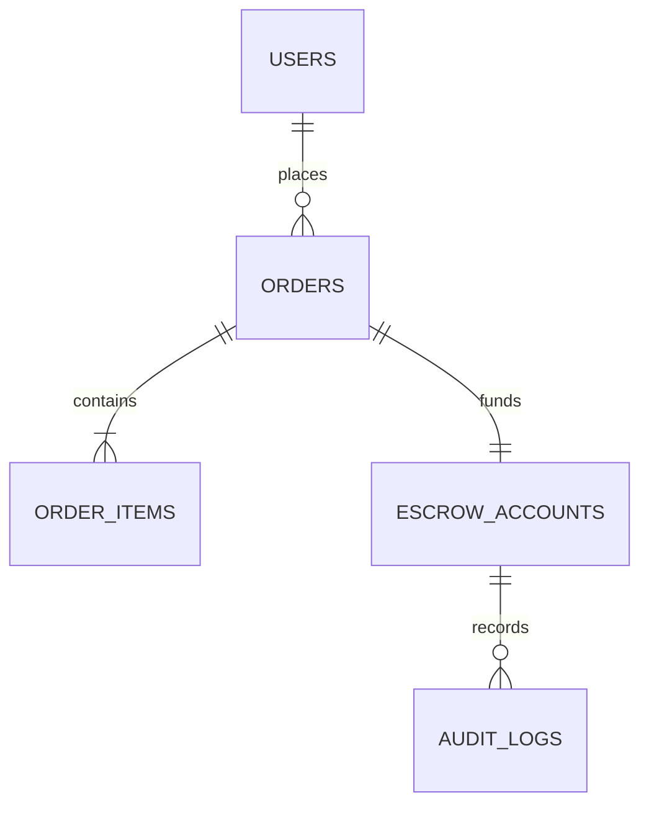
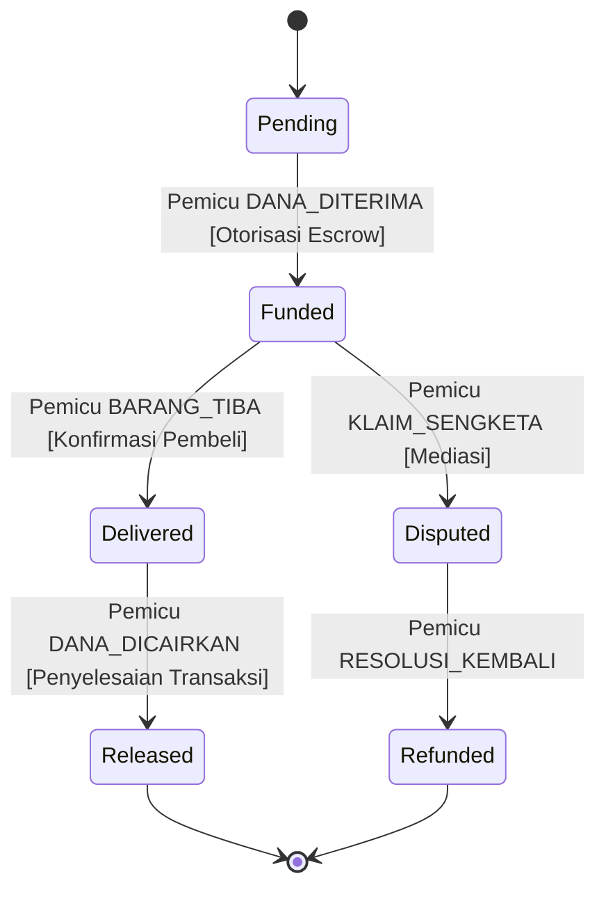

# [Nama Proyek Portofolio]: [Ringkasan Solusi Sistem dalam 1 Kalimat]

> Rancangan arsitektur data relasional, alur transaksi state machine, dan validasi fungsional untuk menyelesaikan masalah [nama masalah bisnis/teknis].

[](https://sysblueprint.pages.dev)
[](https://github.com/zadevpenseo/sysblueprint-community/discussions)
[](LICENSE)

---

## 🎯 1. Konteks Masalah & Kebutuhan Bisnis

Jelaskan konteks masalah secara ringkas dan lugas:
* **Latar Belakang**: Apa friksi atau kerentanan operasional yang dialami sistem sebelumnya?
* **Objektif Arsitektural**: Apa target yang ingin dicapai (misalnya: eliminasi anomali pembaruan data, audit kepatuhan finansial, penjaminan status transaksi tak dapat dibantah).
* **Batasan Sistem**: Batasan throughput, kepatuhan regulasi, atau keterbatasan infrastruktur awal.

---

## 🏛️ 2. Arsitektur Database Relasional (ERD & SQL)

### Diagram Skema Data


### Karakteristik Kunci Skema
1. **Normalisasi**: Memenuhi Bentuk Normal Ketiga (3NF) guna mencegah redundansi transisional.
2. **Integritas Referensial**: Kunci asing (`FOREIGN KEY`) mengikat relasi dengan aturan `ON DELETE RESTRICT` untuk mencegah data yatim (*orphan records*).
3. **Pemberian Indeks**: Indeks komposit terpasang pada kolom pencarian berkala tinggi (`tenant_id, created_at`).

Skrip DDL lengkap tersedia pada [schema.sql](schema.sql).

---

## 🔄 3. Alur Status Transaksi (State Machine SCXML)

Diagram alur status dirancang sesuai spesifikasi W3C SCXML / XState untuk memastikan setiap transisi bersifat deterministik:



---

## 📊 4. Hasil Validasi Rubrik & Pengujian

Proyek ini telah melalui pengujian otomatis evaluator SysBlueprint:
* **Skor Skema Database**: 95 / 100
* **Skor Alur Transaksi**: 90 / 100
* **Skor Gabungan Akhir**: 92.5 / 100 (Predikat: DISTINCTION)
* **Tautan Peer Review Komunitas**: [Diskusi Peer Review #00](https://github.com/zadevpenseo/sysblueprint-community/discussions/00)

---

## 💻 5. Cara Menjalankan & Menguji Secara Lokal

```bash
# Kloning repositori proyek
git clone https://github.com/<username>/<nama-repo>.git
cd <nama-repo>

# Impor skrip SQL ke PostgreSQL atau SQLite lokal
sqlite3 database.db < schema.sql

# Jalankan skrip verifikasi integritas data
python3 verify_schema.py
```

---

## 👤 Penulis

* **Nama Lengkap**: [Nama Anda]
* **Profil GitHub**: [https://github.com/username](https://github.com/username)
* **Portofolio**: [https://username.github.io](https://username.github.io)
