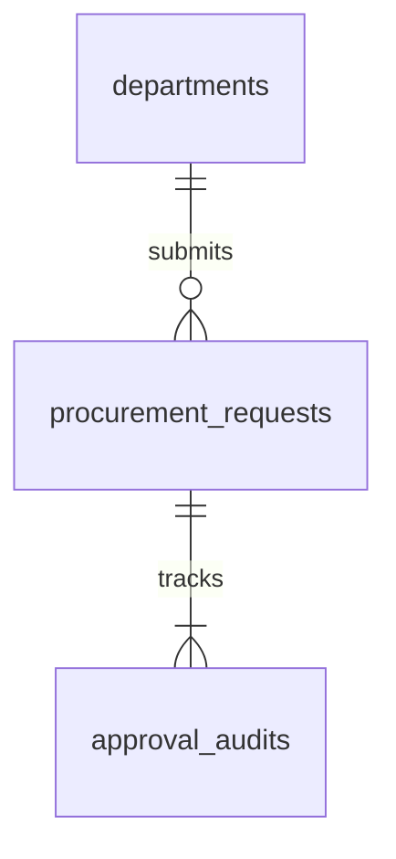
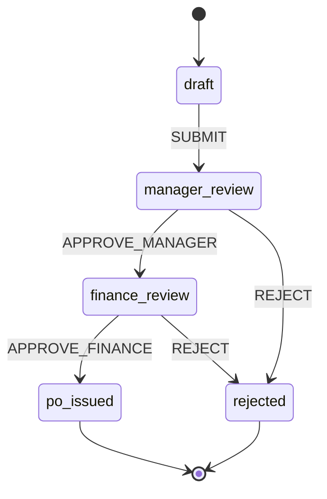

# Enterprise Multi-Tier Procurement Approval System

> Studi kasus perancangan skema database relasional 3NF dan mesin alur status multi-tier approval untuk tata kelola pengadaan barang korporat.

[](https://sysblueprint.pages.dev)
[](https://sysblueprint.pages.dev)
[](https://sysblueprint.pages.dev)

---

## 🎯 1. Konteks Masalah & Kebutuhan

Sistem pengadaan barang enterprise sering menghadapi risiko penipuan internal (*internal fraud*), pesanan pembelian tanpa otorisasi anggaran, dan ketiadaan jejak audit yang tak dapat dimanipulasi. Solusi ini memisahkan peran pemohon (*department requestor*), peninjau operasional (*department manager*), dan pengesah keuangan (*finance division*).

---

## 🏛️ 2. Model Data Relasional



1. **Integritas Referensial**: Kunci asing `dept_id` mengikat ke `departments.id` dengan batasan `ON DELETE RESTRICT` guna memastikan riwayat departemen tidak terhapus selama memiliki berkas pengadaan.
2. **Append-Only Audit Log**: Tabel `approval_audits` bersifat *append-only* untuk memelihara catatan audit stempel waktu bagi setiap keputusan persetujuan.

---

## 🔄 3. Alur Status Transaksi (SCXML State Machine)



---

## 📊 4. Hasil Verifikasi Evaluator

```
Skor Database : 100/100
Skor Alur     : 100/100
Skor Akhir    : 100.0/100 (Predikat: DISTINCTION)
```

Skrip DDL SQL lengkap tersedia pada [schema.sql](schema.sql) dan manifest data dapat diimpor langsung via [project.json](project.json).
